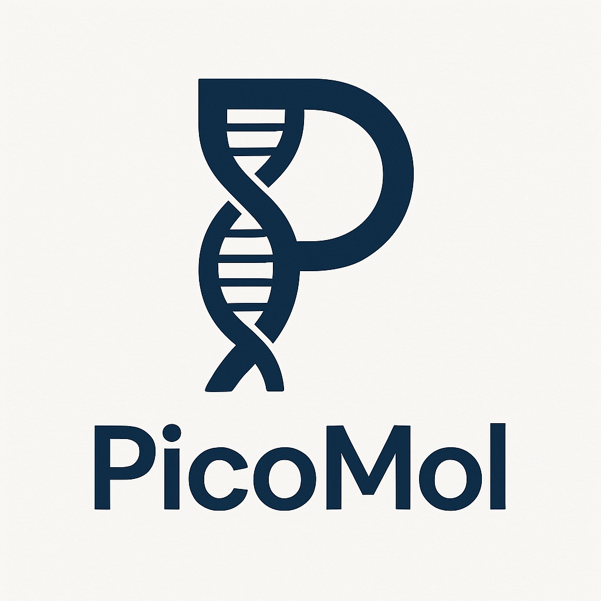

<div align="center">
  
  
  # PicoMol: The Miniature Molecular Visualization and Bioinformatics Suite
</div>

<div align="center">
  
[](https://www.gnu.org/licenses/gpl-3.0)
[](https://www.python.org/downloads/)
[](https://github.com/ultimafounding/PicoMol/releases)
[](https://github.com/psf/black)

</div>

PicoMol is a comprehensive desktop application for molecular visualization, structural analysis, and bioinformatics. Built with PyQt6 and NGL.js, it provides a complete suite of tools for researchers, students, and developers working with protein structures and biomolecular data.

> 🎆 **Version 0.2.0 introduces advanced sequence analysis capabilities**, building upon our production-ready v0.1.0 foundation with professional-grade ORF analysis, primer design, and enhanced export functionality.

## 🆕 Latest Updates (March 2026)

**Advanced Sequence Analysis Suite (BETA):**

- **ORF Analysis:** Comprehensive open reading frame detection with customizable parameters
  - Configurable minimum length, start/stop codons
  - Analysis of all 6 reading frames (forward and reverse)
  - Detailed statistics and sequence preview
- **Primer Design:** Professional PCR primer design with advanced scoring and validation
  - Target region selection with amplicon length calculation
  - Advanced scoring algorithm (Tm, GC content, secondary structures)
  - Primer pair analysis and validation
  - Export capabilities (clipboard, CSV)
- **Sequence Comparison:** Multi-sequence analysis with identity detection and visualization
  - Identity analysis with longest common substring detection
  - Support for file loading and current sequence comparison
- **Enhanced Export:** Professional-quality export system for sequences and maps (PNG, SVG, PDF)
  - Live preview functionality with customizable formatting
  - High-resolution outputs suitable for publications
- **SnapGene-style Visualization:** Improved sequence viewer with enzyme highlighting and feature rendering
  - Restriction site highlighting with colored backgrounds
  - Enhanced enzyme display with professional labeling
  - Optimized performance for large sequences
- **PyQt6 Compatibility:** Full compatibility with PyQt6 for modern systems
- **High-Resolution Export:** True DPI-aware export with professional quality (600 DPI default)

**Previous Release (v0.1.0 - January 2025) - Production Ready:**

- **Stable Core Features:** Comprehensive molecular visualization, BLAST integration, and bioinformatics tools
- **Enhanced Data Export:** Complete analysis results in HTML, JSON, CSV, Excel, and Text formats
- **Professional HTML Reports:** High-resolution graphs with improved layouts and styling
- **Robust API Integration:** InterPro and PROSITE integration with intelligent fallback systems
- **Performance Optimizations:** Improved handling of large structures and complex analyses
- **Production Quality:** Extensive testing, error handling, and user experience improvements

## Features

### 🧬 Core Visualization

- **3D Molecular Viewer**: Interactive visualization powered by NGL.js
- **Multiple Representations**: Cartoon, ball+stick, surface, and more
- **Flexible Coloring**: By chain, residue, secondary structure, etc.
- **PDB Integration**: Direct download and local file support
- **Screenshot Export**: Save high-quality images of your structures

### 🔬 Bioinformatics Tools

- **Sequence Analysis**:
  - Protein properties (MW, pI, hydrophobicity, aromaticity, instability index)
  - Nucleic acid analysis (GC content, translation in all 6 frames, complements)
  - Secondary structure prediction (helix, turn, sheet content)
  - Amino acid and nucleotide composition analysis
- **Advanced Sequence Analysis Suite** (NEW):
  - **ORF Analysis:** Open reading frame detection with customizable parameters
    - Configurable minimum length, start/stop codons
    - Analysis of all 6 reading frames (forward and reverse)
    - Detailed statistics and sequence preview
  - **Primer Design:** Professional PCR primer design tool
    - Target region selection with amplicon length calculation
    - Advanced scoring algorithm (Tm, GC content, secondary structures)
    - Primer pair analysis and validation
    - Export capabilities (clipboard, CSV)
  - **Sequence Comparison:** Multi-sequence analysis tools
    - Identity analysis with longest common substring detection
    - Support for file loading and current sequence comparison
- **Motif & Domain Analysis**:
  - InterPro integration for comprehensive domain annotation
  - PROSITE pattern matching with official API
  - Interactive visualization of domains and motifs
  - Sequence context display with highlighting
  - Advanced filtering options for high-probability motifs
- **Structural Analysis**:
  - Bond angle and distance calculations
  - Secondary structure analysis
  - Ramachandran plot generation
  - **Enhanced Export System:** Complete data export in HTML, JSON, CSV, Excel, and Text formats with high-resolution graphs

### 🧪 BLAST Integration

- **All BLAST Variants**: BLASTP, BLASTN, BLASTX, TBLASTN, TBLASTX
- **NCBIBLAST-like Interface**: Familiar experience for users
- **Multiple Database Support**: Access to major NCBI databases
- **Comprehensive Results**: Detailed alignments and statistics

### 🎨 User Experience

- **Modern Interface**: Clean, tabbed layout with dark/light themes
- **Cross-Platform**: Works on Windows, macOS, and Linux
- **Performance Optimized**: Handles large structures efficiently
- **Drag & Drop**: Easy file loading with drag-and-drop support
- **Comprehensive Reporting**: Professional HTML reports with embedded visualizations
- **Multi-Format Export**: Choose from HTML, JSON, CSV, Excel, or Text export formats
- **Enhanced Export System** (NEW): Professional export capabilities
  - **Map Export:** PNG, SVG, PDF formats with customizable size and DPI
  - **Sequence Export:** FASTA, GenBank, HTML, and annotated text formats
  - **Live Preview:** Preview exports before saving
  - **Custom Formatting:** Adjustable titles, metadata, fonts, and colors
- **Improved Sequence Visualization** (NEW): SnapGene-style features
  - **Enzyme Highlighting:** Visual enzyme boxes with colored backgrounds
  - **Enhanced Annotations:** Professional feature rendering and labeling
  - **Optimized Performance:** Better handling of large sequences

## 🚀 Installation

### Prerequisites

- Python 3.7 or higher (Python 3.8+ recommended for best performance)
- Internet connection (for downloading NGL.js, online BLAST functionality, and API integrations)
- At least 100MB of free disk space
- Optional: Additional packages for enhanced export capabilities (see requirements.txt)

> ℹ️ **Production Ready:** Version 0.1.0 is stable and suitable for research and educational use.

### Quick Install

1. **Clone the repository:**
   ```bash
   git clone https://github.com/ultimafounding/PicoMol.git
   cd PicoMol
   ```

2. **Install dependencies:**
   ```bash
   pip install -r requirements.txt
   ```

3. **Run PicoMol:**
   ```bash
   python picomol.py
   ```

The application will automatically download NGL.js on first run if needed.

**Note:** PicoMol features an organized project structure with source code in `src/`, assets in `assets/`, data files in `data/`, and documentation in `docs/`. The main application file (`picomol.py`) remains in the root directory for easy execution.

### Manual Dependency Installation

If you prefer to install dependencies manually:

**Core Dependencies (Required):**
```bash
pip install PyQt6 PyQt6-WebEngine biopython requests ramachandraw
```

**Optional Dependencies (Enhanced Features):**
```bash
pip install numpy matplotlib pandas openpyxl weasyprint
```

## Usage

### Getting Started

1. **Launch PicoMol:** Run `python picomol.py`
2. **Load a Structure:**
   - Enter a PDB ID (e.g., `1CRN`, `4HHB`) and click \"Fetch\"
   - Use \"Open Local PDB File\" to load your own structures
   - Drag and drop `.pdb` or `.ent` files directly onto the window

### 3D Visualization

- **Change Representation:** Use the dropdown to switch between cartoon, ball+stick, surface, etc.
- **Adjust Colors:** Select different coloring schemes or use uniform colors
- **Control View:** Toggle auto-rotation, change background color
- **Save Images:** Click \"Save Screenshot\" to export the current view

### BLAST Searches

1. **Navigate to BLAST Tab:** Click on the \"BLAST\" tab in the main interface
2. **Choose BLAST Type:** Select from BLASTP, BLASTN, BLASTX, TBLASTN, or TBLASTX
3. **Enter Query:** Paste your sequence or upload a FASTA file
4. **Configure Search:** Select database, adjust parameters as needed
5. **Run Search:** Click \"BLAST\" to submit your search to NCBI
6. **View Results:** Comprehensive results with alignments and statistics

### Bioinformatics Analysis

1. **Navigate to Bioinformatics Tab:** Click on the "Bioinformatics" tab

2. **Choose Analysis Type:** Select from the available sub-tabs:
   - **Sequence Analysis:** Comprehensive sequence analysis tools
   - **Protein Motifs and Domains:** Motif and domain analysis tools
   - **Structure:** Structural analysis tools

#### Sequence Analysis

1. **Input Methods:**

   - **Direct Entry:** Paste sequences (plain text or FASTA format)
   - **Load from Structure:** Use sequence from currently loaded PDB structure
   - **Load from File:** Import from FASTA files with multi-sequence support
2. **Analysis Options:**
   - **Automatic Type Detection:** Sequences are automatically classified
   - **Manual Override:** Change sequence type if needed
   - **Comprehensive Results:** Detailed analysis with exportable data

#### Motif and Domain Analysis

1. **Sequence Input:**

   - **Load from Current Structure:** Extract sequence from loaded PDB structure
   - **Load from File:** Import FASTA sequences
   - **Direct Entry:** Paste protein sequences with example provided
2. **Search Options:**
   - **InterPro Search:** Comprehensive domain annotation (Pfam, SMART, PROSITE, CDD)
   - **PROSITE Search:** Motif pattern recognition with official API
   - **Search All Databases:** Combined search for complete analysis
3. **Advanced Features:**
   - **Filtering:** Exclude high-probability motifs for cleaner results
   - **Visualization:** Interactive domain and motif visualization
   - **Enhanced Export:** Professional HTML reports with embedded visualizations, plus JSON, CSV, Excel, and Text formats
   - **Context Display:** Click any motif in results to view sequence context with highlighting
   - **Progress Tracking:** Progress bar remains visible until all searches complete

## Project Structure

```
PicoMol/
├── picomol.py                     # Main application entry point
├── setup_ngl.py                   # NGL.js setup utility
├── requirements.txt               # Python dependencies
├── README.md                      # This file
├── LICENSE                        # GPL v3.0 license
├── .gitignore                     # Git ignore rules
├── src/                          # Source code modules
│   ├── core/                     # Core functionality
│   │   ├── bioinformatics_tools.py  # Comprehensive bioinformatics analysis suite
│   │   ├── motif_analysis.py        # Protein motif and domain analysis tools
│   │   ├── structural_analysis.py   # Structural analysis and calculations
│   │   ├── enhanced_pdb_puller.py   # Enhanced PDB fetching and metadata
│   │   ├── pdb_fetch_worker.py      # Optimized PDB fetch worker
│   │   └── preferences.py           # Settings and preferences management
│   ├── gui/                      # User interface components
│   │   ├── advanced_analysis.py     # Advanced sequence analysis widgets (ORF, primers)
│   │   ├── custom_sequence_widget.py # Custom sequence input and display widgets
│   │   ├── export_dialog.py         # Enhanced export dialog for sequences and maps
│   │   ├── sequence_viewer.py       # Main sequence visualization and analysis interface
│   │   ├── snapgene_sequence_view.py # SnapGene-style sequence rendering
│   │   ├── theme_manager.py         # Theme system and UI customization
│   │   ├── welcome_dialog.py        # Welcome screen dialog
│   │   ├── enzyme_selection_dialog.py # Enzyme selection for cloning workflows
│   │   ├── plasmid_viewer.py       # Plasmid map visualization
│   │   ├── sequence_editor.py       # Sequence editing tools
│   │   ├── restriction_cloning_dialog.py # Restriction cloning workflow
│   │   ├── gibson_assembly_dialog.py # Gibson assembly workflow
│   │   ├── golden_gate_dialog.py    # Golden Gate cloning workflow
│   │   ├── virtual_gel_dialog.py   # Virtual gel electrophoresis simulation
│   │   ├── digest_enzyme_selection_dialog.py # Enzyme selection for digestion
│   │   └── sequence_text_view.py    # Text-based sequence display
│   └── blast_utils/              # BLAST functionality package
│       ├── __init__.py              # Package initialization
│       ├── blast_utils.py           # Core BLAST functionality
│       ├── blast_utils_ncbi_layout.py  # NCBI-style UI layouts
│       ├── blast_results_parser.py     # Results parsing and formatting
│       └── accession_validator.py      # Sequence and accession validation
├── assets/                       # Static resources
│   └── ngl_assets/              # NGL.js library storage
├── data/                         # Data files and runtime storage
│   └── pulled_structures/       # Downloaded PDB files and generated viewers
└── docs/                         # Documentation
    ├── CHANGELOG.md             # Version history and changes
    ├── KNOWN_BUGS.md            # Known issues and limitations
    ├── next_release.md          # Upcoming features and changes
    └── release_notes/           # Detailed release notes
```

## Technical Details

### Architecture

PicoMol combines several powerful technologies:

**Core Technologies:**

- **PyQt6:** Cross-platform GUI framework providing the main interface (updated from PyQt5)
- **QWebEngineView:** Embedded web browser for 3D visualization
- **NGL.js:** High-performance molecular graphics library (MIT licensed)
- **Biopython:** Comprehensive bioinformatics tools for sequence and structure analysis
- **NCBI BLAST:** Online BLAST searches and sequence analysis

**Enhanced Features (Optional Dependencies):**

- **NumPy:** Scientific computing for structural calculations
- **Matplotlib:** Advanced plotting and high-resolution graph generation
- **Pandas:** Data manipulation and multi-format export functionality
- **OpenPyXL:** Excel file format support (.xlsx)
- **WeasyPrint:** PDF generation capabilities
- **ramachandraw:** Ramachandran plot generation and analysis

**Design Principles:**

- **Modular Architecture:** Clean separation of concerns with organized source structure
- **Graceful Degradation:** Core functionality works without optional dependencies
- **Theme System:** Customizable appearance with multiple built-in themes
- **Asynchronous Processing:** Non-blocking operations for better user experience

### Bioinformatics Implementation

- **Dual-Mode Analysis:** Full-featured analysis with Biopython, basic analysis without
- **Smart FASTA Parsing:** Handles both Biopython and manual parsing methods
- **Sequence Validation:** Real-time validation with detailed error reporting
- **Multi-threading:** Background analysis prevents UI freezing
- **API Integration:** Direct connection to InterPro and PROSITE web services
- **Fallback Systems:** Local pattern matching when APIs are unavailable
- **Intelligent Parsing:** Robust parsing of various API response formats
- **Enhanced Export System:** Multi-format export with consistent data across all formats
- **High-Resolution Graphics:** Improved graph rendering for professional reports
- **Extensible Design:** Easy to add new analysis tools and features

### BLAST Implementation

- **Online Integration:** Direct connection to NCBI BLAST servers
- **Asynchronous Processing:** Non-blocking searches with progress indicators
- **Result Parsing:** Comprehensive parsing of XML and text BLAST outputs
- **NCBI Compliance:** Interface design matches official NCBI BLAST pages

### Motif and Domain Analysis Implementation

- **InterPro API:** Official EBI InterPro web service integration
- **PROSITE API:** Direct connection to ExPASy PROSITE ScanProsite service
- **Hybrid Approach:** API-first with local pattern fallback for reliability
- **Sequence Context Display:** Interactive motif context viewer with highlighting
- **Progress Management:** Smart progress tracking for concurrent searches
- **Result Caching:** Efficient storage and retrieval of analysis results
- **Comprehensive Export System:** HTML, JSON, CSV, Excel, and Text formats with embedded visualizations
- **Enhanced HTML Reports:** Professional layouts with high-resolution graphs and improved styling
- **Data Consistency:** All calculated data consistently included across export formats
- **Error Handling:** Robust error recovery and user feedback

## 🔄 Version History

### Version 0.1.0 (January 2025) - Production Ready 🎆

**Major Milestone Release:**

- **Production Quality:** Comprehensive testing, error handling, and stability improvements
- **Performance Optimizations:** Enhanced handling of large structures and complex analyses
- **Robust API Integration:** Stable InterPro and PROSITE integration with intelligent fallback systems
- **Cross-Platform Compatibility:** Improved compatibility across Windows, macOS, and Linux
- **Comprehensive Documentation:** Updated technical documentation and user guides

### Version 0.0.5 (July 2024) - Enhanced Export & Visualization

- **Comprehensive Data Export:** All analysis results in multiple formats (HTML, JSON, CSV, Excel, Text)
- **Enhanced HTML Reports:** Professional layouts with high-resolution graphs
- **Fixed Graph Rendering:** Resolved overlapping elements in exported visualizations
- **Data Consistency:** All calculated data consistently included across export formats

### Version 0.0.4 (July 2024) - Motif & Domain Analysis

- **InterPro Integration:** Official EBI InterPro API for comprehensive domain annotation
- **PROSITE Integration:** Official ExPASy PROSITE ScanProsite API for motif recognition
- **Advanced Visualization:** Interactive domain and motif visualization
- **Enhanced UI:** Updated welcome dialog, tooltips, and interface improvements

## Contributing

We welcome contributions! Please feel free to:
- Report bugs or request features via [GitHub Issues](https://github.com/ultimafounding/PicoMol/issues)
- Submit pull requests for improvements
- Share feedback and suggestions

## 📚 Citations

Here are the citations for projects and tools included in PicoMol:

### NGL.js

```
Rose AS, Bradley AR, Valasatava Y, Duarte JM, Prlić A, Rose PW.
NGL viewer: web-based molecular graphics for large complexes.
Bioinformatics 34(21): 3755-3758, 2018.
doi:10.1093/bioinformatics/bty419

Rose AS, Hildebrand PW.
NGL Viewer: a web application for molecular visualization.
Nucleic Acids Research 43(W1): W576-W579, 2015.
doi:10.1093/nar/gkv402
```

### BLAST

```
Altschul SF, Gish W, Miller W, Myers EW, Lipman DJ.
Basic local alignment search tool.
Journal of Molecular Biology 215(3): 403-410, 1990.
doi:10.1016/S0022-2836(05)80360-2

Altschul SF, Madden TL, Schäffer AA, Zhang J, Zhang Z, Miller W, Lipman DJ.
Gapped BLAST and PSI-BLAST: a new generation of protein database search programs.
Nucleic Acids Research 25(17): 3389-3402, 1997.
doi:10.1093/nar/25.17.3389
```

### InterPro

```
Apweiler R, Attwood TK, Bairoch A, Bateman A, Birney E, Biswas M, Bucher P, Cerutti L, Corpet F, Croning MD, et al.
The InterPro database, an integrated documentation resource for protein families, domains and functional sites.
Nucleic Acids Research 29(1): 37-40, 2001.
doi:10.1093/nar/29.1.37

Paysan-Lafosse T, Blum M, Chuguransky S, Grego T, Pinto BL, Salazar GA, Bileschi ML, Bork P, Bridge A, Colwell L, et al.
InterPro in 2022.
Nucleic Acids Research 51(D1): D418-D427, 2023.
doi:10.1093/nar/gkac993
```

### Pfam

```
Bateman A, Birney E, Durbin R, Eddy SR, Howe KL, Sonnhammer EL.
The Pfam protein families database.
Nucleic Acids Research 28(1): 263-266, 2000.
doi:10.1093/nar/28.1.263

Mistry J, Chuguransky S, Williams L, Qureshi M, Salazar GA, Sonnhammer ELL, Tosatto SCE, Paladin L, Raj S, Richardson LJ, et al.
Pfam: The protein families database in 2021.
Nucleic Acids Research 49(D1): D412-D419, 2021.
doi:10.1093/nar/gkaa913
```

### PROSITE
```
Bairoch A.
PROSITE: a dictionary of sites and patterns in proteins.
Nucleic Acids Research 19(Suppl): 2241-2245, 1991.
doi:10.1093/nar/19.suppl.2241

Bairoch A, Bucher P, Hofmann K.
The PROSITE database, its status in 1997.
Nucleic Acids Research 25(1): 217-221, 1997.
doi:10.1093/nar/25.1.217

Sigrist CJA, de Castro E, Cerutti L, Cuche BA, Hulo N, Bridge A, Bougueleret L, Xenarios I.
New and continuing developments at PROSITE.
Nucleic Acids Research 41(D1): D344-D347, 2013.
doi:10.1093/nar/gks1067
```

### PDB Format

```
Berman HM, Westbrook J, Feng Z, Gilliland G, Bhat TN, Weissig H, 
Shindyalov IN, Bourne PE.
The Protein Data Bank.
Nucleic Acids Research 28(1): 235-242, 2000.
doi:10.1093/nar/28.1.235
```

### ramachandraw

```
@software{Cirilo_ramachandraw,
  author = {Cirilo, Alexandre},
  title = {{ramachandraw: A Ramachandran plotting tool}},
  url = {https://github.com/alxdrcirilo/ramachandraw},
  version = {1.0.1},
  year = {2024}
}
```

## 📄 License

This project is licensed under the GNU General Public License v3.0 - see the [LICENSE](LICENSE) file for details.

### Third-Party Licenses

- **NGL.js:** MIT License (compatible with GPL v3.0)
- **Biopython:** Biopython License (compatible with GPL v3.0)

## Support

- **Documentation:** Check this README and inline help tooltips
- **Issues:** Report problems on [GitHub Issues](https://github.com/ultimafounding/PicoMol/issues)
- **Feedback:** Use the built-in feedback dialog (Help → Send Feedback)

---

*PicoMol: Making molecular visualization and bioinformatics accessible to everyone.*
